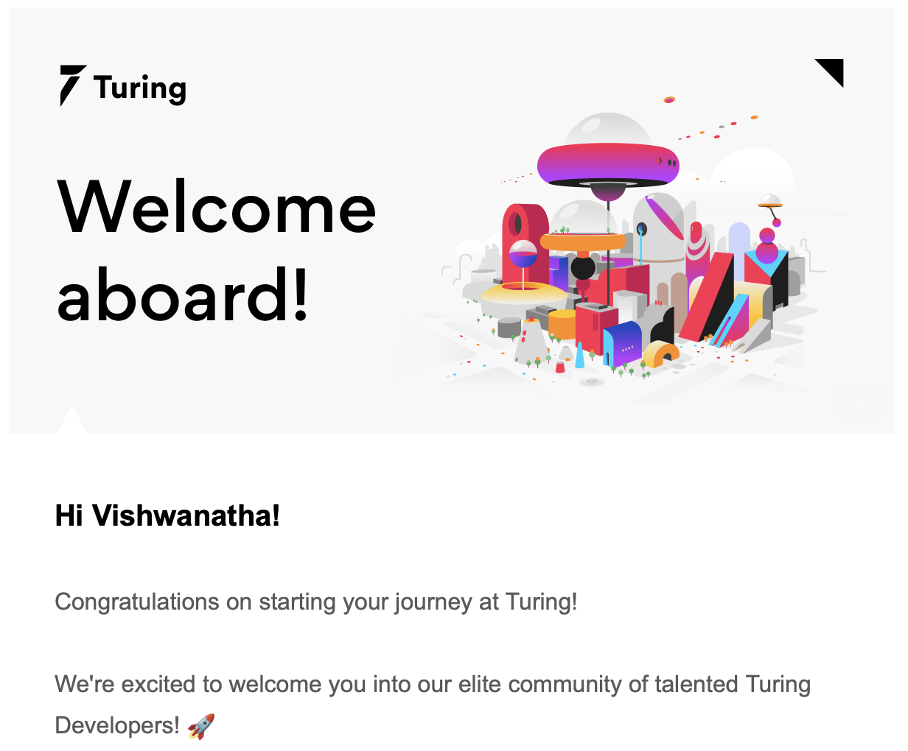

A lot of people have not been asking me what I did this year.

So, I decided to forcefully tell them 😛

No. Most importantly, I wanted to keep accountablity for myself & also I wanted to convince my own brain that things are going well and there is no need to Panic(My brain is all FOMO mode lately)

> "You can't connect the dots looking forward; you can only connect them looking backwards" - Steve Jobs

It is so true. I had a whole different plan at the start of the year & as days progressed, the year took it's own shape. A lot of good things happened that were not even considered at the start of the year. 

So, let's get started. 

## Work 
This was one of the major theme of my life this year. An opportunity to work for a US based company came out of nowhere in December last year. I was all prepared to take a break and prepare for my next steps but I ended up accepting the offer and giving it a try.

This turned out to be an awesome opportunity.

I got to work with developers from 10+ countries. Learned a lot about different tech stacks and latest AI developments.

In summary, this year was a rewarding year in terms of Career. 

## Social

Completely remote work comes with its own Pros and Cons. 

It gives the freedom of choosing your location, spend time with family whenver required etc. But it makes the overall social equation a little complicated.

You start to miss that one place you use to go and work. A place where you used to talk to like minded people, go out with them.

So needless to say, I had to act on my own to have a social life. That meant doing a lot of travelling & going places.

### Trip to Coorg

### Solo trip to Coorg & Waynad

### Trip to Bali

### Trip to Darjeeling

## Family

## Health & Fitness

## Learning new things

